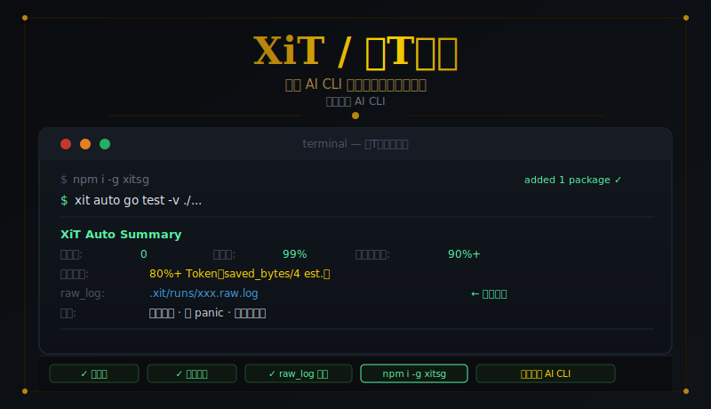
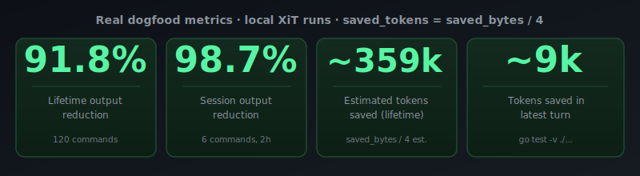
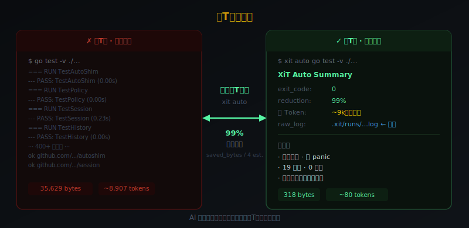
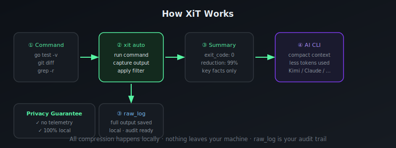
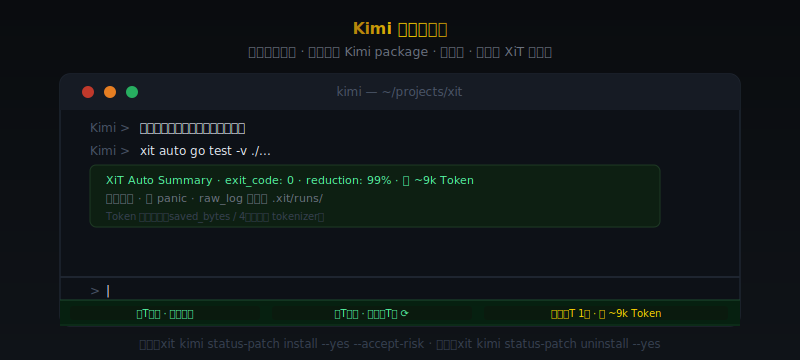

<div align="center">



# XiT / 吸T神功

**专治 AI CLI 被终端日志撑爆上下文**

`go test -v ./...` 输出 35,629 字节 → 吸T后 318 字节 · 压缩率 **99%** · 省 ~9k Token

[](https://www.npmjs.com/package/xitsg)
[](https://go.dev)
[](LICENSE)
[](#支持平台)

</div>

---

## 一行安装

```bash
npm i -g xitsg
```

安装后命令名为 `xit`。无需配置，开箱即用。

---

## 实战战绩

> 本地 dogfood 数据 · Token 为估算值（saved\_bytes / 4，非精确 tokenizer）



| 指标 | 数据 |
|------|------|
| 历史压缩率 | **91.8%**（120 条命令） |
| 当前会话压缩率 | **98.7%**（6 条命令） |
| 历史估算省 Token | **~359k**（saved\_bytes / 4） |
| 单次最高节省 | **~9k Token**（`go test -v ./...`） |
| 命中率 | **100%**（每条命令均生成摘要） |

---

## 它解决什么问题

Kimi、Claude Code、Codex 等 AI CLI 会把你每次运行的终端输出原封不动塞进上下文。

`go test -v ./...` 一跑，9000 个 Token 没了。
`docker logs` 一扔，上下文直接爆掉。

**吸T神功的解法：**

```
AI 说 xit auto go test -v ./...
         ↓
XiT 捕获完整输出 → 过滤噪音 → 输出摘要（318 字节）
         ↓
原始日志本地留存 → .xit/runs/xxx.raw.log
```

AI 读摘要，你留证据。Token 压力归零。

---

## 吸T前后对比



---

## 江湖适配图谱



| AI CLI | 状态 | 接入方式 |
|--------|------|----------|
| **Kimi CLI** | ✅ 已打通 | rules 模式 + hook observe + toolbar patch |
| **Claude Code** | 🔄 适配中 | `xit auto <cmd>` 直接调用 |
| **DeepSeek CLI** | 🎯 下一目标 | 调研中 |
| **Codex CLI** | 📋 规划中 | — |
| **Cursor** | 📋 规划中 | — |

---

## 常用招式

```bash
# 运功：让 AI 通过 xit auto 发起任何命令
xit auto go test -v ./...
xit auto git diff HEAD~1
xit auto grep -r "TODO" ./src
xit auto docker logs mycontainer --tail 200

# 查阅：查看历史战绩
xit history

# 留证：查看某次原始输出
xit log show <run-id>

# 清场：清理旧日志
xit log clean --older-than 7d
```

| 招式 | 命令 | 效果 |
|------|------|------|
| 运功 | `xit auto <任意命令>` | 捕获 + 压缩 + 摘要 |
| 查阅 | `xit history` | 查历史战绩与压缩率 |
| 留证 | `xit log show <id>` | 查完整原始输出 |
| 清场 | `xit log clean` | 清理旧 raw\_log |

---

## Kimi 实战案例



**rules 模式（推荐）：** 把以下规则加入 Kimi 的 SKILL.md / rules 文件：

```
当你需要运行终端命令时，使用 xit auto <命令> 代替直接运行命令。
例：xit auto go test -v ./...（而非 go test -v ./...）
```

**状态栏 patch（可选）：**

```bash
# 安装
xit kimi status-patch install --yes --accept-risk

# 回滚
xit kimi status-patch uninstall --yes
```

> 此功能修改本地 Kimi package，可随时回滚，不影响 XiT 主功能。详见 [docs/kimi.md](docs/kimi.md)。

---

## 下一站：DeepSeek 系 AI CLI

DeepSeek CLI 正在调研接入方案。目标：通过 `xit auto` 无缝接入，同样实现 90%+ 压缩率。

进展会在 [Releases](https://github.com/stephenywilson/xit/releases) 同步更新。

---

## 安全与隐私

- **零 telemetry**：不收集任何使用数据
- **全程本地**：所有输出处理在本机完成，不经过任何外部服务器
- **raw\_log 留证**：完整原始输出保存在 `.xit/runs/`，随时可查

详见 [docs/privacy.md](docs/privacy.md)。

---

## 路线图

- [x] `xit auto` 核心压缩引擎
- [x] raw\_log 本地留存
- [x] Kimi CLI 适配（rules + hook + toolbar）
- [x] npm 全平台分发（macOS / Linux / Windows）
- [ ] DeepSeek CLI 适配
- [ ] Claude Code 深度集成
- [ ] 自定义过滤器 DSL
- [ ] 压缩规则插件系统

---

## npm 包说明

包名 `xitsg`，CLI 命令为 `xit`。

```bash
npm i -g xitsg    # 安装
xit --version     # 验证
xit auto --help   # 查看 auto 子命令帮助
```

**支持平台：**

| 平台 | 架构 | 支持 |
|------|------|------|
| macOS | Apple Silicon (arm64) | ✅ |
| macOS | Intel (x64) | ✅ |
| Linux | x64 | ✅ |
| Linux | arm64 | ✅ |
| Windows | x64 | ✅ |

源码：[github.com/stephenywilson/xit](https://github.com/stephenywilson/xit)

---

<div align="center">

*全程本地运功 · 无任何数据离开本机 · raw\_log 是你的审计留证*

</div>
