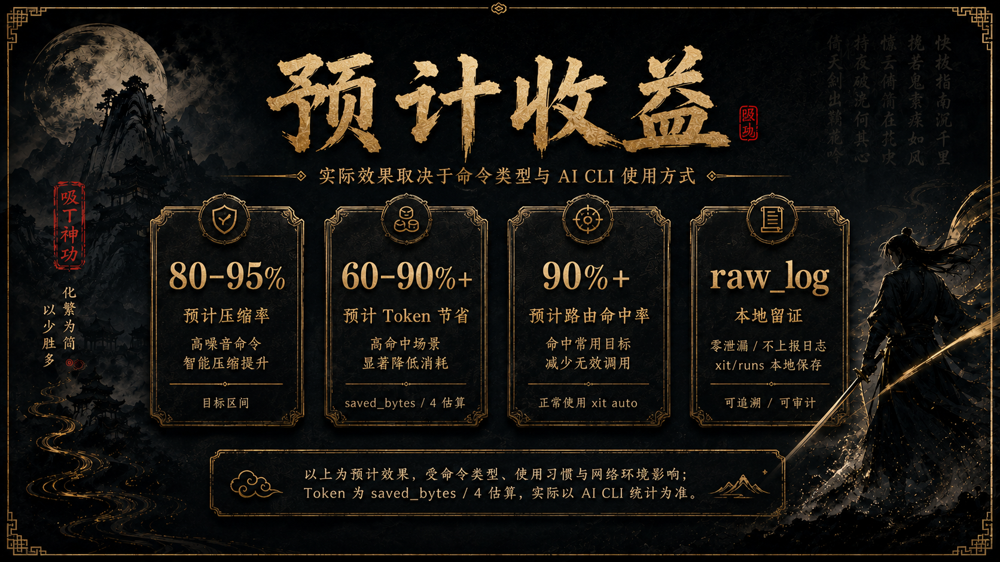
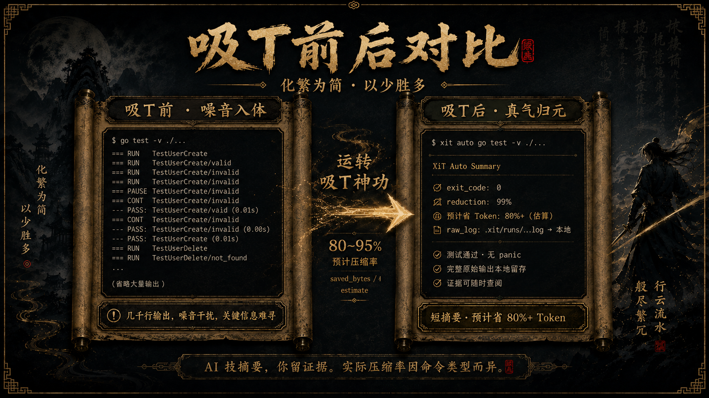
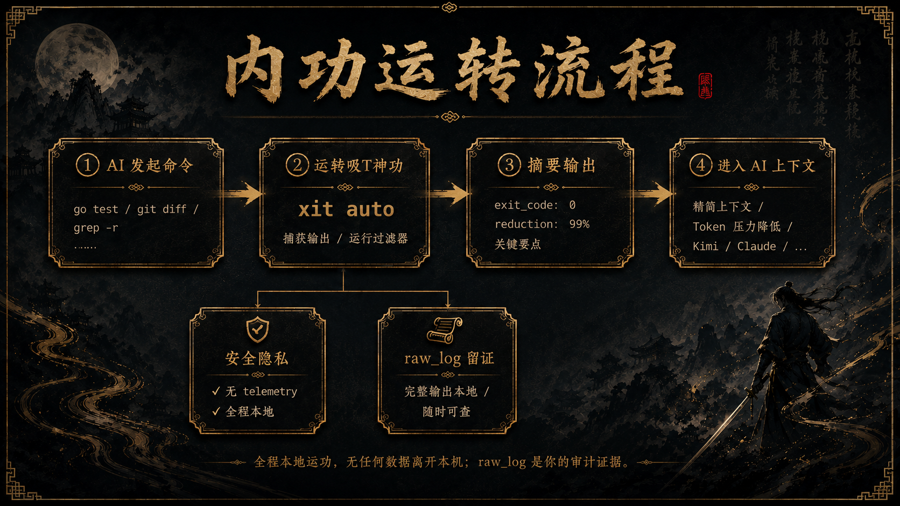

<div align="center">


# XiT / 吸T神功

**专治 AI CLI 被终端日志撑爆上下文**

XiT 会把 `go test`、`grep`、`git diff`、`docker logs` 这类高噪音命令输出，吸成 AI 能读懂的短摘要；完整 raw_log 留在本地，随时可查。

适用于所有会调用终端命令的 AI Coding CLI（Kimi · Claude Code · Codex · Cursor 等）。

[](https://www.npmjs.com/package/xitsg)
[](https://go.dev)
[](LICENSE)
[](#npm-包说明)

</div>

---

## 预计收益



| 指标 | 预计效果 |
|------|-------:|
| 高噪音命令压缩率 | 80–95% |
| Token 节省 | 60–90%+ |
| 路由命中率目标 | 90%+ |
| 单次冗长测试预计节省 | 约 5k–15k Token |
| 原始证据 | 本地 raw_log 留存 |
| 数据上传 | 无遥测 / 不上传 |

实际效果取决于命令类型、输出规模和 AI CLI 是否正确使用 `xit auto`；Token 按 `saved_bytes / 4` 估算。

---

## 一行安装

```bash
npm i -g xitsg
```

安装后命令为 `xit`，无需配置，开箱即用。

> npm 上 `xit` 名字已被占用，所以包名是 `xitsg`；但安装后的命令仍然是 `xit`。

```bash
xit --version      # 验证安装
xit auto echo hello  # 验证 auto 子命令
```

---

## 快速开练

**普通跑法（AI 看到全部噪音）：**

```bash
go test -v ./...
```

**吸T跑法（AI 只看摘要，你留全部证据）：**

```bash
xit auto go test -v ./...
```

AI 看到的是压缩摘要。你保留的是完整 raw_log。这就是吸T神功的核心。

---

## 吸T前后对比



**吸T前 —— `go test -v ./...`**

几千到数万行终端日志直接进入 AI 上下文，Token 瞬间爆满。

**吸T后 —— `xit auto go test -v ./...`**

```
吸T完成

command: go test -v ./...
exit_code: 0
原始输出: ~10.4k Token
吸后摘要: 116 Token
本次节省: ~10k Token
降噪率: 99%（示例，非通用承诺）
raw_log: .xit/runs/20260530-go-test.raw.log

key_facts:
- All tests passed.
- 完整原始输出已留存在本地
```

AI 读摘要，你留证据。

---

## 工作原理



```
AI CLI 发起命令
  → xit auto 接管执行
  → 原始输出写入本地 raw_log（.xit/runs/）
  → 输出被压缩成短摘要
  → 短摘要进入 AI 上下文
  → Token 压力下降
```

XiT 不替你写代码，也不上传日志。它只做一件事：把终端噪音变成可审计的短摘要。

---

## 支持的命令类型

| 命令类型 | 吸T策略 |
|---------|---------|
| `go test` / `cargo test` / `pytest` / `npm test` | 提取退出码、通过/失败数、失败摘要、关键错误 |
| `git diff` | 汇总代码变更、风险路径、关键 hunk |
| `grep` / `rg` | 按文件聚合匹配结果，限制噪音行数 |
| `docker logs` | 去重重复日志，突出 error / panic / fail |
| `find` / `ls` / `tree` | 聚合目录结构，避免长列表撑爆上下文 |
| `build` / `lint` | 汇总失败原因、警告数量和关键文件 |

---

## 江湖适配图谱

| AI CLI / 门派 | 当前状态 | 说明 |
|--------------|---------|------|
| **Kimi CLI** | ✅ done | status patch + turn lifecycle + toolbar |
| **Claude Code** | ✅ done | observe hook + hitrate + command-backed statusLine |
| **Antigravity CLI** | ✅ done | rules + command-backed statusLine + autostate |
| **Codex CLI** | ✅ done | AGENTS.md rules + PreToolUse hook observe + hitrate；bottom statusLine unsupported by current Codex CLI |
| **Aider** | ✅ rules adapter | `.aider.conf.yml` + `XIT_AIDER.md`；hooks/statusLine not available |
| **Cursor** | ✅ hook observe + strict | `beforeShellExecution` observe + strict mode GUI ask + hitrate；reroute/statusLine not enabled |
| **DeepSeek 系 CLI** | 📋 planned | 调研中 |
| **Gemini** | 📋 planned | 迁移至 Antigravity |

XiT 的目标是成为所有 AI Coding CLI 的本地输出压缩层。只要这个 AI 会调用终端命令，就有机会练吸T神功。

---

## Kimi 实战案例

Kimi CLI 是 XiT 第一套已跑通的实战适配，用来验证 rules、hook、turn lifecycle、中文状态栏这条链路可行。

```bash
xit init kimi --method official_hook --scope user --yes
xit kimi rules install --scope user --yes
```

可选中文状态栏：

```bash
xit kimi status-patch install --yes --accept-risk
```

完整状态栏截图、安装细节与回滚说明见：[docs/kimi.md](docs/kimi.md)

---

## 本地 dogfood 参考

下面不是通用承诺，只是 XiT 仓库自己的实战样本。

| 口径 | 本仓库 dogfood 结果 |
|------|------------------:|
| 历史输出压缩率 | 91.5% |
| 当前会话输出压缩率 | 98.7% |
| 最近窗口路由命中率 | 100% |
| 累计估算节省 | 约 340k Token |
| 最近单次测试节省 | 约 9k Token（`go test -v ./...`） |

这些数据会随命令类型、输出规模、仓库大小、AI CLI 的路由命中率变化。第一屏采用预计收益区间，避免把本地 dogfood 误读为通用承诺。Token 均为 `saved_bytes / 4` 估算，非 tokenizer 精确计数。

---

## 下一站：DeepSeek 系 AI CLI

DeepSeek 在中文开发者里有很强认知。XiT 下一步会优先调研 DeepSeek 系终端编程工具（DeepCode / DeepSeek-backed CLI / 兼容 OpenAI endpoint 的终端 agent）。

调研方向：

- 如何调用 shell
- 是否有 hook 注入点
- 是否能稳定使用 `xit auto`
- 是否能统计命中率并展示本地压缩收益

目前状态：调研中，尚未完成适配。进展同步于 [Releases](https://github.com/stephenywilson/xit/releases)。

---

## 安全与隐私

- **零遥测**：不收集任何使用数据，不上传日志
- **全程本地**：所有处理在本机完成，不经过任何外部服务器
- **raw_log 留证**：完整原始输出保存在 `.xit/runs/`，随时可查
- **本地统计**：`.xit/history.jsonl` 保存本地压缩统计，不离开本机
- **状态栏 patch**：可选高级功能，修改本地 Kimi package，可随时回滚
- **Token 节省**：估算值，计算方式为 `saved_tokens = saved_bytes / 4`

详见 [docs/privacy.md](docs/privacy.md)。

---

## npm 包说明

包名 `xitsg`，CLI 命令为 `xit`。

```bash
npm i -g xitsg      # 安装
xit --version       # 验证
xit auto --help     # 查看帮助
```

| 平台 | 架构 | 状态 |
|------|------|------|
| macOS | Apple Silicon (arm64) | ✅ |
| macOS | Intel (x64) | ✅ |
| Linux | x64 | ✅ |
| Linux | arm64 | ✅ |
| Windows | x64 | ✅ |

源码：[github.com/stephenywilson/xit](https://github.com/stephenywilson/xit)

---

## 路线图

**已上线**

- 核心压缩引擎（`xit auto`）+ raw_log 本地留存
- Kimi CLI 完整适配（rules + hook + 中文状态栏）
- Claude Code 适配（observe hook + hitrate + command-backed statusLine）
- Antigravity CLI 适配（rules + statusLine + autostate）
- Codex CLI 适配（AGENTS.md rules + PreToolUse hook observe + hitrate）
- Cursor 适配（beforeShellExecution observe + strict mode GUI ask + hitrate）
- npm 全平台分发（macOS / Linux / Windows）

**近期**

- VS Code / Cursor Extension MVP（local VSIX，本地 dashboard + status bar）
- DeepSeek 系 AI CLI 调研与适配
- 更多高噪音命令过滤器

**后续**

- VS Code Marketplace 发布
- 可选 tokenizer 估算增强
- 更多 AI Coding CLI 接入

---

<div align="center">

*全程本地运功 · 无任何数据离开本机 · raw_log 是你的审计留证*

</div>
