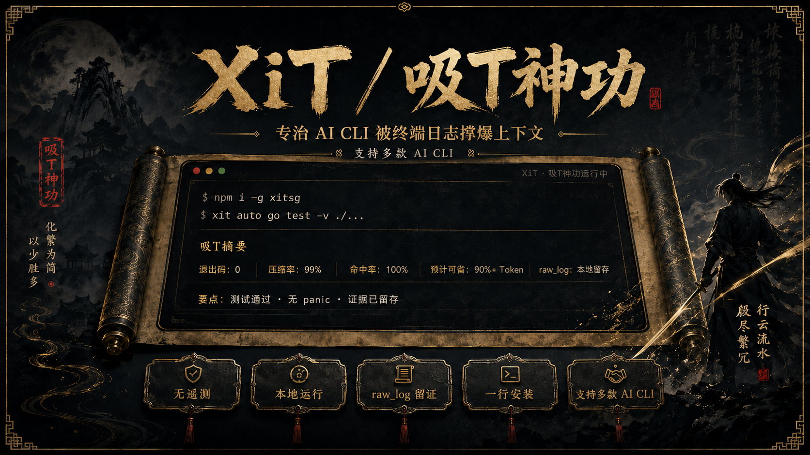
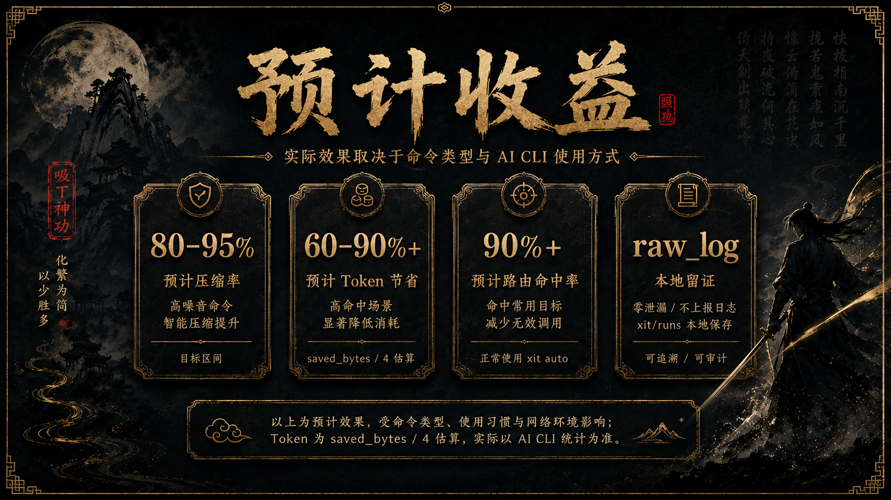
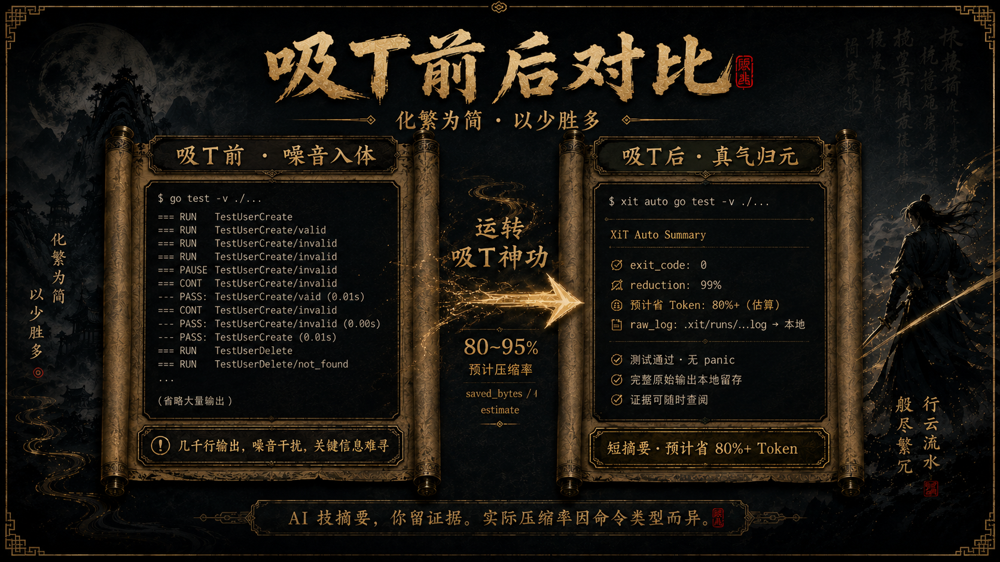
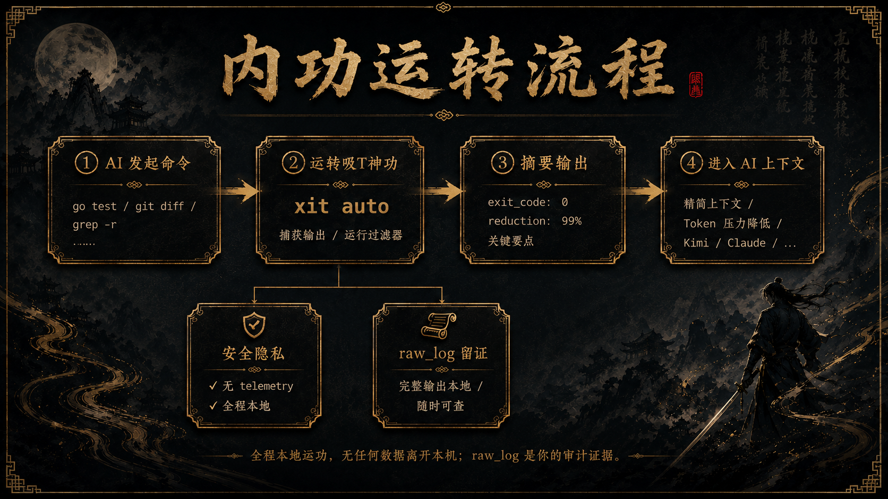

<div align="center">



# XiT / 吸T神功

**专治 AI CLI 被终端日志撑爆上下文**

XiT 会把 `go test`、`grep`、`git diff`、`docker logs` 这类高噪音命令输出，吸成 AI 能读懂的短摘要；完整 raw_log 留在本地，随时可查。

XiT / 吸T神功 是面向 AI Coding 工作流的本地终端输出压缩层：把高噪音命令交给 `xit auto`，将长输出压缩成 AI 可读摘要，同时把 raw log 留在本地，减少上下文消耗。已验证适配 Kimi CLI、Claude Code、Codex CLI、ChatGPT 桌面应用（Codex mode，通过共享的 Codex 配置与 Hook 体系）、OpenCode、Cursor（详见下方[适配图谱](#江湖适配图谱)，不同 CLI 的支持深度不同）。

XiT / 吸T神功 is a local output-compression layer for AI coding workflows. It routes noisy terminal output through `xit auto`, keeps raw logs locally, and shows estimated Token savings in supported CLI / IDE surfaces.

[](https://www.npmjs.com/package/xitsg)
[](https://marketplace.visualstudio.com/items?itemName=XiT.xit-vscode)
[](https://github.com/stephenywilson/xit/releases)
[](https://go.dev)
[](LICENSE)
[](#npm-包说明)

**当前版本 / Current release** — CLI / npm `xitsg@0.2.51` · VS Code Extension `0.0.36` · GitHub Release `v0.2.51`

</div>

---

## 最新版 / Latest: 0.2.51 · VS Code 0.0.36

0.2.51 fixes a version-gate bug where a CLI exactly at the server's declared minimum version (`current == min_cli`) could be incorrectly refused by `xit auto` if the server conservatively sent `severity=blocked`. Equality (and anything above the minimum) is now always allowed; only `current < min_cli` blocks. The same equality-safe fix ships for the VS Code extension's `min_vscode` check.

This release also adds support for **Codex mode inside the ChatGPT desktop app**, through the shared Codex configuration and hook system — Codex CLI, the Codex VS Code extension, and ChatGPT Desktop's Codex mode all resolve to the exact same project-scoped hook, never a duplicate. See `xit chatgpt status` / `xit chatgpt diagnose`. XiT does not collect or claim to support the ChatGPT app's general Chat or Work modes. The Dashboard also gained a "By Surface" breakdown (Codex CLI / Codex IDE / ChatGPT Desktop · Codex / etc.) alongside the existing "By AI Adapter" view.

0.2.51 修复了一个版本门控 bug：当 CLI 版本恰好等于服务端声明的最低版本（`current == min_cli`）时，如果服务端保守地返回 `severity=blocked`，`xit auto` 可能被错误拒绝。现在等于或高于最低版本永远放行，只有 `current < min_cli` 才会阻断；VS Code 扩展的 `min_vscode` 判断同样修复。

本轮同时新增对 **ChatGPT 桌面应用中 Codex mode** 的支持：通过共享的 Codex 配置与 Hook 体系，Codex CLI、Codex VS Code 扩展、ChatGPT 桌面应用的 Codex mode 都指向同一个项目级 hook，不会重复安装。详见 `xit chatgpt status` / `xit chatgpt diagnose`。XiT 不收集、也不声称支持 ChatGPT 应用的普通 Chat 或 Work 模式。Dashboard 新增「By Surface」细分视图（Codex CLI / Codex IDE / ChatGPT Desktop · Codex 等），与现有的「By AI Adapter」视图并列。

> 隐私边界不变：无 raw-log 遥测，仅匿名使用统计，且可关闭。raw log 始终留在本地。XiT 永不上传终端原始输出、prompt、AI 回复、命令文本、文件路径、用户名、邮箱、API key 或完整 session id。`xit telemetry off` 或 `XIT_TELEMETRY=off` 可关闭统计。
> No raw-log telemetry. Anonymous usage metrics only, and can be disabled. Raw logs stay local. XiT never uploads raw terminal output, prompts, AI replies, command text, file paths, usernames, emails, API keys, or full session ids. Disable with `xit telemetry off` or `XIT_TELEMETRY=off`.

完整变更记录见 [docs/releases/](docs/releases/)。

---

## 预计收益



| 指标 | 预计效果 |
|------|-------:|
| 高噪音命令压缩率 | 80–95% |
| Token 节省 | 60–90%+ |
| 路由命中率目标 | 90%+ |
| 单次冗长测试预计节省 | 约 5k–15k Token |
| 原始证据 | 本地 raw_log 留存 |
| 数据上传 | 无 raw-log 遥测；仅匿名统计，可关闭 |

实际效果取决于命令类型、输出规模和 AI CLI 是否正确使用 `xit auto`；Token 按 `saved_bytes / 4` 估算。

---

## 一行安装

```bash
npm i -g xitsg
```

安装后命令为 `xit`，无需配置，开箱即用。

> npm 上 `xit` 名字已被占用，所以包名是 `xitsg`；但安装后的命令仍然是 `xit`。

```bash
xit --version      # 验证安装
xit auto echo hello  # 验证 auto 子命令
```

## CLI Installation

```bash
npm install -g xitsg
xit --version
```

Expected:

```text
xit version 0.2.48
```

## VS Code Extension

XiT is available as a VS Code extension: **吸T神功（XiT）**, current version `0.0.34`. Install "XiT" from the [VS Code Marketplace](https://marketplace.visualstudio.com/items?itemName=XiT.xit-vscode).

- **Status Bar**: live XiT state（守护中 / 正在吸T / 神功正在收工 / 本次省 约 X.XXk Token）
- **Dashboard**: 本轮发功（本次省 / 本轮共吸 / 降噪率 / 状态）/ 今日功力 / 功力累计
- **Codex Chat Bridge**: when Codex (in the VS Code Codex Chat panel) calls `xit auto`, the status bar and Dashboard update automatically through Codex's own hooks — no extra setup
- **Claude Code panel bridge**: Claude Code's hook protocol can only allow/deny/ask (it cannot rewrite commands like Codex), so XiT denies high-noise commands and recommends the `xit auto` form; once Claude retries with the recommended command, the bridge picks it up. Final results display after Claude's turn ends, or after a short safety fallback if no turn-end signal is available — see [docs/claude.md](docs/claude.md) for current limitations
- workspace watch diagnostics, so users know which project XiT is monitoring

XiT does **not** read chat content. It only reads local XiT state, run history, and hook metadata — never the prompt, the AI's reply, raw command output, or full session/thread IDs.

---

## 快速开练

**普通跑法（AI 看到全部噪音）：**

```bash
go test -v ./...
```

**吸T跑法（AI 只看摘要，你留全部证据）：**

```bash
xit auto go test -v ./...
```

AI 看到的是压缩摘要。你保留的是完整 raw_log。这就是吸T神功的核心。

---

## 吸T前后对比



**吸T前 —— `go test -v ./...`**

几千到数万行终端日志直接进入 AI 上下文，Token 瞬间爆满。

**吸T后 —— `xit auto go test -v ./...`**

```
吸T完成

command: go test -v ./...
exit_code: 0
原始输出: ~10.4k Token
吸后摘要: 116 Token
本次节省: ~10k Token
降噪率: 99%（示例，非通用承诺）
raw_log: .xit/runs/20260530-go-test.raw.log

key_facts:
- All tests passed.
- 完整原始输出已留存在本地
```

AI 读摘要，你留证据。

---

## 工作原理



```
AI CLI 发起命令
  → xit auto 接管执行
  → 原始输出写入本地 raw_log（.xit/runs/）
  → 输出被压缩成短摘要
  → 短摘要进入 AI 上下文
  → Token 压力下降
```

XiT 不替你写代码，也不上传日志。它只做一件事：把终端噪音变成可审计的短摘要。

---

## 支持的命令类型

| 命令类型 | 吸T策略 |
|---------|---------|
| `go test` / `cargo test` / `pytest` / `npm test` | 提取退出码、通过/失败数、失败摘要、关键错误 |
| `git diff` | 汇总代码变更、风险路径、关键 hunk |
| `grep` / `rg` | 按文件聚合匹配结果，限制噪音行数 |
| `docker logs` | 去重重复日志，突出 error / panic / fail |
| `find` / `ls` / `tree` | 聚合目录结构，避免长列表撑爆上下文 |
| `build` / `lint` | 汇总失败原因、警告数量和关键文件 |

---

## 江湖适配图谱

| AI CLI / 门派 | 当前状态 | 说明 |
|--------------|---------|------|
| **Kimi CLI** | ✅ done | status patch + turn lifecycle + toolbar |
| **Claude Code** | ✅ done | observe hook + hitrate + command-backed statusLine |
| **Antigravity CLI** | ✅ done | rules + command-backed statusLine + autostate |
| **Codex CLI** | ✅ done | AGENTS.md rules + PreToolUse hook observe + hitrate；bottom statusLine unsupported by current Codex CLI |
| **ChatGPT Desktop App（Codex mode）** | ✅ done（共享 Codex hook） | 通过共享的 Codex 配置与 Hook 体系，支持 ChatGPT 桌面应用中的 Codex mode；不声称支持 Chat / Work 模式；`xit chatgpt status`/`xit hook status chatgpt` |
| **Aider** | ✅ rules adapter | `.aider.conf.yml` + `XIT_AIDER.md`；hooks/statusLine not available |
| **OpenCode** | ✅ hook/reroute | `tool.execute.before` hook reroute + AI 直接写 `xit auto` 时自动注入 OpenCode 上下文 + 工具输出显示中文吸T神功摘要；暂不支持 OpenCode 主界面常驻 statusline/footer |
| **Cursor** | 🧪 Experimental / Observe | `beforeShellExecution` observe + strict mode GUI ask + hitrate；reroute/statusLine not enabled，不做完整支持承诺 |
| **VS Code Extension** | ✅ Supported（`0.0.36`） | Status Bar + Dashboard（本轮发功/今日功力/功力累计）+ Codex Chat Bridge + Claude Code panel bridge（deny + 推荐 retry + fallback finalization） |
| **DeepSeek 系 CLI** | 📋 planned | 调研中 |
| **Gemini** | 📋 not yet supported / planned | 暂未实现，不做未验证承诺 |

XiT 的长期方向是覆盖更多会调用终端命令的 AI Coding CLI；上表是当前已验证的真实适配范围，不代表对未列出 CLI 的支持承诺。

---

## Kimi 实战案例

Kimi CLI 是 XiT 第一套已跑通的实战适配，用来验证 rules、hook、turn lifecycle、中文状态栏这条链路可行。

```bash
xit init kimi --method official_hook --scope user --yes
xit kimi rules install --scope user --yes
```

可选中文状态栏：

```bash
xit kimi status-patch install --yes --accept-risk
```

完整状态栏截图、安装细节与回滚说明见：[docs/kimi.md](docs/kimi.md)

---

## 本地 dogfood 参考

下面不是通用承诺，只是 XiT 仓库自己的实战样本。

| 口径 | 本仓库 dogfood 结果 |
|------|------------------:|
| 历史输出压缩率 | 91.5% |
| 当前会话输出压缩率 | 98.7% |
| 最近窗口路由命中率 | 100% |
| 累计估算节省 | 约 340k Token |
| 最近单次测试节省 | 约 9k Token（`go test -v ./...`） |

这些数据会随命令类型、输出规模、仓库大小、AI CLI 的路由命中率变化。第一屏采用预计收益区间，避免把本地 dogfood 误读为通用承诺。Token 均为 `saved_bytes / 4` 估算，非 tokenizer 精确计数。

---

## 下一站：DeepSeek 系 AI CLI

DeepSeek 在中文开发者里有很强认知。XiT 下一步会优先调研 DeepSeek 系终端编程工具（DeepCode / DeepSeek-backed CLI / 兼容 OpenAI endpoint 的终端 agent）。

调研方向：

- 如何调用 shell
- 是否有 hook 注入点
- 是否能稳定使用 `xit auto`
- 是否能统计命中率并展示本地压缩收益

目前状态：调研中，尚未完成适配。进展同步于 [Releases](https://github.com/stephenywilson/xit/releases)。

---

## 安全与隐私

- **无 raw-log 遥测**：XiT 永不上传终端原始输出、prompt、AI 回复、命令文本、文件路径、用户名、邮箱、API key 或完整 session id
- **匿名使用统计（默认开启，可关闭）**：XiT 可发送匿名使用统计，例如 adapter 类型、版本号、字节数、压缩率、估算节省 Token、成功/失败状态。可通过 `xit telemetry off` 或 `XIT_TELEMETRY=off` 关闭
- **raw_log 留证**：完整原始输出保存在 `.xit/runs/`，随时可查
- **本地统计**：`.xit/history.jsonl` 保存本地压缩统计，不离开本机
- **状态栏 patch**：可选高级功能，修改本地 Kimi package，可随时回滚
- **Token 节省**：估算值，计算方式为 `saved_tokens = saved_bytes / 4`

XiT may send anonymous usage metrics such as adapter type, version, byte counts, compression ratio, and estimated token savings. XiT never uploads raw terminal output, prompts, AI replies, command text, file paths, usernames, emails, API keys, or full session ids. Disable with `xit telemetry off` or `XIT_TELEMETRY=off`.

详见 [docs/privacy.md](docs/privacy.md) 与 [docs/telemetry.md](docs/telemetry.md)。

---

## npm 包说明

包名 `xitsg`，CLI 命令为 `xit`。

```bash
npm i -g xitsg      # 安装
xit --version       # 验证
xit auto --help     # 查看帮助
```

| 平台 | 架构 | 状态 |
|------|------|------|
| macOS | Apple Silicon (arm64) | ✅ |
| macOS | Intel (x64) | ✅ |
| Linux | x64 | ✅ |
| Linux | arm64 | ✅ |
| Windows | x64 | ✅ |

源码：[github.com/stephenywilson/xit](https://github.com/stephenywilson/xit)

---

## 路线图

**已上线**

- 核心压缩引擎（`xit auto`）+ raw_log 本地留存
- Kimi CLI 完整适配（rules + hook + 中文状态栏）
- Claude Code 适配（observe hook + hitrate + command-backed statusLine）
- Antigravity CLI 适配（rules + statusLine + autostate）
- Codex CLI 适配（AGENTS.md rules + PreToolUse hook observe + hitrate）
- ChatGPT 桌面应用 Codex mode 适配（通过共享的 Codex 配置与 Hook 体系，见 `xit chatgpt status`；不声称支持 Chat / Work 模式）
- Cursor 适配（beforeShellExecution observe + strict mode GUI ask + hitrate）
- OpenCode 适配（`tool.execute.before` hook reroute + 工具输出中文摘要；主界面 statusline/footer 暂不支持）
- npm 全平台分发（macOS / Linux / Windows）
- VS Code extension `0.0.36` 已发布到 Visual Studio Marketplace（Status Bar + Dashboard + Codex Chat Bridge + Claude Code panel bridge）

**近期**

- DeepSeek 系 AI CLI 调研与适配
- 更多高噪音命令过滤器
- VS Code Claude Code 面板的 turn 结束信号（Stop hook）真实可靠性持续验证

**后续**

- 可选 tokenizer 估算增强
- 更多 AI Coding CLI 接入

---

<div align="center">

*全程本地运功 · 无任何数据离开本机 · raw_log 是你的审计留证*

</div>
