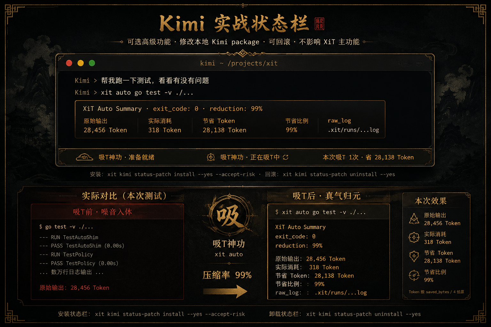

# Kimi CLI 实战适配

Kimi CLI 是 XiT 第一套已跑通的实战适配，用来验证 rules、hook、turn lifecycle、中文状态栏这条链路可行。



---

## 安装

```bash
xit init kimi --method official_hook --scope user --yes
xit kimi rules install --scope user --yes
```

重启 Kimi 后验证：

```bash
xit kimi rules status --scope user
```

验证 Kimi 是否正确使用 XiT：在 Kimi 中说"帮我跑测试"，Kimi 应该调用 `xit auto go test -v ./...`，而不是直接调用 `go test -v ./...`。

---

## 可选中文状态栏

状态栏是可选高级功能，会修改本地 Kimi Python package（`ui/shell/prompt.py`）。不影响 XiT 主功能，可随时回滚。

状态栏示例：

- `吸T神功 · 准备就绪`：等待下一轮命令
- `吸T神功 · 正在吸T中`：xit auto 正在接管高噪音命令
- `本次吸T 1 次 · 省 X Token`：本次 turn 的估算节省
- `XiT ON · raw_log 留证中`：已留存原始输出

**安装：**

```bash
xit kimi status-patch install --yes --accept-risk
```

**回滚：**

```bash
xit kimi status-patch uninstall --yes
```

其他 patch 命令：

```bash
xit kimi status-patch status      # 检查兼容性（只读）
xit kimi status-patch dry-run     # 预览 patch 计划（不改文件）
xit kimi status-patch validate    # 在临时副本验证语法
```

> Kimi 更新可能使 patch 失效，安装前会自动创建备份。

---

## Hook observe 模式

记录 Kimi 的 tool call 到 `.xit/kimi-hooks/events.jsonl`，不阻断任何操作。

```bash
xit hook status kimi --scope user
xit hook stats kimi
```

---

## Safe reroute（可选）

对高噪音命令返回 deny，建议 Kimi 改用 `xit auto <原命令>`。

```bash
xit hook enable-reroute kimi --yes
xit hook disable-reroute kimi --yes
```

> 注意：Kimi 会把 deny 显示为 Shell tool ERROR，不是软提示。Kimi 不一定会自动重跑 `xit auto <命令>`。推荐优先使用 rules 模式。

---

## Token 口径

Token 节省是估算值：

```
saved_tokens = saved_bytes / 4
```

这不是 tokenizer 精确计数。实际效果取决于命令类型、输出规模和 AI CLI 是否正确使用 `xit auto`。

---

## 安全说明

- 无遥测，不上传日志
- raw_log 保存在本地（`.xit/runs/`）
- 状态栏 patch 可回滚，安装前自动备份
- XiT 主功能不依赖状态栏 patch

---

## 健康检查

```bash
xit doctor kimi --deep
# 或
xit kimi doctor
```

## 查看压缩统计

```bash
xit kimi benchmark
xit gain
xit gain --json   # JSON output for local dashboards / editor integrations
```

## 完整卸载

```bash
xit kimi rules uninstall --scope user --yes
xit uninstall kimi --method official_hook --scope user --yes
xit kimi status-patch uninstall --yes
```
